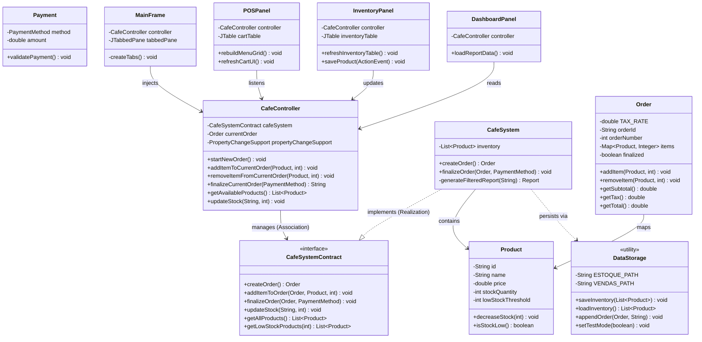

# ☕ Java Café - POS & Inventory System

Project developed for the Object-Oriented Programming course, consisting of a complete Point of Sale (POS) and Inventory Management System with a graphical user interface in Java Swing.

### 👥 Group Identification

* **Davi Azevedo Guedes de Sá**
* **Natanael Costa de Freitas**
* **Pietro Gutiérrez García-Urrutia**

---

## 1. Requirements

The system meets all proposed requirements for POS management. In addition to the base requirements, we implemented custom validations for payment methods (rejecting zero/negative values) and a configurable alert system for low stock monitoring.

## 2. Project Description

The project adopts the MVC (Model-View-Controller) architecture pattern...



## 3. Comments About the Code

The system applies fundamental pillars of Object-Oriented Programming:

* **Polymorphism:** The graphical interface interacts with the system through the `CafeSystemContract` interface, facilitating dependency injection and testing. Furthermore, we used overriding polymorphism (e.g., `StatusCellRenderer`) to modify the visual behavior of the tables.
* **Inheritance:** Used in extending visual panels (`JPanel`, `JFrame`) and in creating a clean domain exception architecture (`OutOfStockException`, `EmptyOrderException`, `InvalidPaymentException`).
* **Encapsulation:** Entities protect their internal state. Identifiers are immutable, and modifications to the cart (`Order`) occur only via controlled methods to ensure exact financial calculations.

## 4. Test Plan

The quality plan focused on validating critical business rules using automated unit tests. Using the **JUnit 5** library, we developed 20 test cases that cover:

1. Adding and removing items with mathematical recalculation of taxes.
2. Exception handling for out-of-stock items or payment errors.
3. Database isolation (insertion of a `testMode` flag so tests run on parallel files, protecting the official database).

## 5. Test Results

All 20 unit test scenarios were successfully executed (100% pass rate) in the *Test Runner* of JUnit, ensuring the system is resilient to unexpected inputs.

**Real Output Log of Technical Execution (JUnit Output Panel):**

```text
%TESTC  20 v2
%TSTTREE2,test.java.br.usp.icmc.scc0204.javacafe.CafeSystemTest,true,20,false,1,CafeSystemTest,,[engine:junit-jupiter]/[class:test.java.br.usp.icmc.scc0204.javacafe.CafeSystemTest]
%TSTTREE3,testEmptyOrderExceptionOnFinalize(test.java.br.usp.icmc.scc0204.javacafe.CafeSystemTest),false,1,false,2,testEmptyOrderExceptionOnFinalize(),,[engine:junit-jupiter]/[class:test.java.br.usp.icmc.scc0204.javacafe.CafeSystemTest]/[method:testEmptyOrderExceptionOnFinalize()]
%TSTTREE4,testGetLowStockProductsList(test.java.br.usp.icmc.scc0204.javacafe.CafeSystemTest),false,1,false,2,testGetLowStockProductsList(),,[engine:junit-jupiter]/[class:test.java.br.usp.icmc.scc0204.javacafe.CafeSystemTest]/[method:testGetLowStockProductsList()]
%TSTTREE5,testRemovePartialQuantityFromOrder(test.java.br.usp.icmc.scc0204.javacafe.CafeSystemTest),false,1,false,2,testRemovePartialQuantityFromOrder(),,[engine:junit-jupiter]/[class:test.java.br.usp.icmc.scc0204.javacafe.CafeSystemTest]/[method:testRemovePartialQuantityFromOrder()]
%TSTTREE6,testUpdateProductPrice(test.java.br.usp.icmc.scc0204.javacafe.CafeSystemTest),false,1,false,2,testUpdateProductPrice(),,[engine:junit-jupiter]/[class:test.java.br.usp.icmc.scc0204.javacafe.CafeSystemTest]/[method:testUpdateProductPrice()]
%TSTTREE7,testSystemUpdateStockMethod(test.java.br.usp.icmc.scc0204.javacafe.CafeSystemTest),false,1,false,2,testSystemUpdateStockMethod(),,[engine:junit-jupiter]/[class:test.java.br.usp.icmc.scc0204.javacafe.CafeSystemTest]/[method:testSystemUpdateStockMethod()]
%TSTTREE8,testLowStockAlertIndicator(test.java.br.usp.icmc.scc0204.javacafe.CafeSystemTest),false,1,false,2,testLowStockAlertIndicator(),,[engine:junit-jupiter]/[class:test.java.br.usp.icmc.scc0204.javacafe.CafeSystemTest]/[method:testLowStockAlertIndicator()]
%TSTTREE9,testOutOfStockException(test.java.br.usp.icmc.scc0204.javacafe.CafeSystemTest),false,1,false,2,testOutOfStockException(),,[engine:junit-jupiter]/[class:test.java.br.usp.icmc.scc0204.javacafe.CafeSystemTest]/[method:testOutOfStockException()]
%TSTTREE10,testDecreaseStockDirectlyThrowsException(test.java.br.usp.icmc.scc0204.javacafe.CafeSystemTest),false,1,false,2,testDecreaseStockDirectlyThrowsException(),,[engine:junit-jupiter]/[class:test.java.br.usp.icmc.scc0204.javacafe.CafeSystemTest]/[method:testDecreaseStockDirectlyThrowsException()]
%TSTTREE11,testPaymentValidationSuccess(test.java.br.usp.icmc.scc0204.javacafe.CafeSystemTest),false,1,false,2,testPaymentValidationSuccess(),,[engine:junit-jupiter]/[class:test.java.br.usp.icmc.scc0204.javacafe.CafeSystemTest]/[method:testPaymentValidationSuccess()]
%TSTTREE12,testOrderMathCalculations(test.java.br.usp.icmc.scc0204.javacafe.CafeSystemTest),false,1,false,2,testOrderMathCalculations(),,[engine:junit-jupiter]/[class:test.java.br.usp.icmc.scc0204.javacafe.CafeSystemTest]/[method:testOrderMathCalculations()]
%TSTTREE13,testAddNegativeQuantityIgnored(test.java.br.usp.icmc.scc0204.javacafe.CafeSystemTest),false,1,false,2,testAddNegativeQuantityIgnored(),,[engine:junit-jupiter]/[class:test.java.br.usp.icmc.scc0204.javacafe.CafeSystemTest]/[method:testAddNegativeQuantityIgnored()]
%TSTTREE14,testChangeLowStockThreshold(test.java.br.usp.icmc.scc0204.javacafe.CafeSystemTest),false,1,false,2,testChangeLowStockThreshold(),,[engine:junit-jupiter]/[class:test.java.br.usp.icmc.scc0204.javacafe.CafeSystemTest]/[method:testChangeLowStockThreshold()]
%TSTTREE15,testRemoveItemFromOrderCompletely(test.java.br.usp.icmc.scc0204.javacafe.CafeSystemTest),false,1,false,2,testRemoveItemFromOrderCompletely(),,[engine:junit-jupiter]/[class:test.java.br.usp.icmc.scc0204.javacafe.CafeSystemTest]/[method:testRemoveItemFromOrderCompletely()]
%TSTTREE16,testOrderIsFinalizedStatus(test.java.br.usp.icmc.scc0204.javacafe.CafeSystemTest),false,1,false,2,testOrderIsFinalizedStatus(),,[engine:junit-jupiter]/[class:test.java.br.usp.icmc.scc0204.javacafe.CafeSystemTest]/[method:testOrderIsFinalizedStatus()]
%TSTTREE17,testPaymentValidationThrowsExceptionForZeroAmount(test.java.br.usp.icmc.scc0204.javacafe.CafeSystemTest),false,1,false,2,testPaymentValidationThrowsExceptionForZeroAmount(),,[engine:junit-jupiter]/[class:test.java.br.usp.icmc.scc0204.javacafe.CafeSystemTest]/[method:testPaymentValidationThrowsExceptionForZeroAmount()]
%TSTTREE18,testPaymentValidationThrowsExceptionForNegativeAmount(test.java.br.usp.icmc.scc0204.javacafe.CafeSystemTest),false,1,false,2,testPaymentValidationThrowsExceptionForNegativeAmount(),,[engine:junit-jupiter]/[class:test.java.br.usp.icmc.scc0204.javacafe.CafeSystemTest]/[method:testPaymentValidationThrowsExceptionForNegativeAmount()]
%TSTTREE19,testInventoryRestockUpdatesQuantity(test.java.br.usp.icmc.scc0204.javacafe.CafeSystemTest),false,1,false,2,testInventoryRestockUpdatesQuantity(),,[engine:junit-jupiter]/[class:test.java.br.usp.icmc.scc0204.javacafe.CafeSystemTest]/[method:testInventoryRestockUpdatesQuantity()]
%TSTTREE20,testSuccessfulOrderAndStockDeduction(test.java.br.usp.icmc.scc0204.javacafe.CafeSystemTest),false,1,false,2,testSuccessfulOrderAndStockDeduction(),,[engine:junit-jupiter]/[class:test.java.br.usp.icmc.scc0204.javacafe.CafeSystemTest]/[method:testSuccessfulOrderAndStockDeduction()]
%TSTTREE21,testRemoveItemNotInOrderIgnored(test.java.br.usp.icmc.scc0204.javacafe.CafeSystemTest),false,1,false,2,testRemoveItemNotInOrderIgnored(),,[engine:junit-jupiter]/[class:test.java.br.usp.icmc.scc0204.javacafe.CafeSystemTest]/[method:testRemoveItemNotInOrderIgnored()]
%TSTTREE22,testGenerateReceiptContainsProductName(test.java.br.usp.icmc.scc0204.javacafe.CafeSystemTest),false,1,false,2,testGenerateReceiptContainsProductName(),,[engine:junit-jupiter]/[class:test.java.br.usp.icmc.scc0204.javacafe.CafeSystemTest]/[method:testGenerateReceiptContainsProductName()]
%TESTS  3,testEmptyOrderExceptionOnFinalize(test.java.br.usp.icmc.scc0204.javacafe.CafeSystemTest)
%TESTE  3,testEmptyOrderExceptionOnFinalize(test.java.br.usp.icmc.scc0204.javacafe.CafeSystemTest)
%TESTS  4,testGetLowStockProductsList(test.java.br.usp.icmc.scc0204.javacafe.CafeSystemTest)
%TESTE  4,testGetLowStockProductsList(test.java.br.usp.icmc.scc0204.javacafe.CafeSystemTest)
%TESTS  5,testRemovePartialQuantityFromOrder(test.java.br.usp.icmc.scc0204.javacafe.CafeSystemTest)
%TESTE  5,testRemovePartialQuantityFromOrder(test.java.br.usp.icmc.scc0204.javacafe.CafeSystemTest)
%TESTS  6,testUpdateProductPrice(test.java.br.usp.icmc.scc0204.javacafe.CafeSystemTest)
%TESTE  6,testUpdateProductPrice(test.java.br.usp.icmc.scc0204.javacafe.CafeSystemTest)
%TESTS  7,testSystemUpdateStockMethod(test.java.br.usp.icmc.scc0204.javacafe.CafeSystemTest)
%TESTE  7,testSystemUpdateStockMethod(test.java.br.usp.icmc.scc0204.javacafe.CafeSystemTest)
%TESTS  8,testLowStockAlertIndicator(test.java.br.usp.icmc.scc0204.javacafe.CafeSystemTest)
%TESTE  8,testLowStockAlertIndicator(test.java.br.usp.icmc.scc0204.javacafe.CafeSystemTest)
%TESTS  9,testOutOfStockException(test.java.br.usp.icmc.scc0204.javacafe.CafeSystemTest)
%TESTE  9,testOutOfStockException(test.java.br.usp.icmc.scc0204.javacafe.CafeSystemTest)
%TESTS  10,testDecreaseStockDirectlyThrowsException(test.java.br.usp.icmc.scc0204.javacafe.CafeSystemTest)
%TESTE  10,testDecreaseStockDirectlyThrowsException(test.java.br.usp.icmc.scc0204.javacafe.CafeSystemTest)
%TESTS  11,testPaymentValidationSuccess(test.java.br.usp.icmc.scc0204.javacafe.CafeSystemTest)
%TESTE  11,testPaymentValidationSuccess(test.java.br.usp.icmc.scc0204.javacafe.CafeSystemTest)
%TESTS  12,testOrderMathCalculations(test.java.br.usp.icmc.scc0204.javacafe.CafeSystemTest)
%TESTE  12,testOrderMathCalculations(test.java.br.usp.icmc.scc0204.javacafe.CafeSystemTest)
%TESTS  13,testAddNegativeQuantityIgnored(test.java.br.usp.icmc.scc0204.javacafe.CafeSystemTest)
%TESTE  13,testAddNegativeQuantityIgnored(test.java.br.usp.icmc.scc0204.javacafe.CafeSystemTest)
%TESTS  14,testChangeLowStockThreshold(test.java.br.usp.icmc.scc0204.javacafe.CafeSystemTest)
%TESTE  14,testChangeLowStockThreshold(test.java.br.usp.icmc.scc0204.javacafe.CafeSystemTest)
%TESTS  15,testRemoveItemFromOrderCompletely(test.java.br.usp.icmc.scc0204.javacafe.CafeSystemTest)
%TESTE  15,testRemoveItemFromOrderCompletely(test.java.br.usp.icmc.scc0204.javacafe.CafeSystemTest)
%TESTS  16,testOrderIsFinalizedStatus(test.java.br.usp.icmc.scc0204.javacafe.CafeSystemTest)
%TESTE  16,testOrderIsFinalizedStatus(test.java.br.usp.icmc.scc0204.javacafe.CafeSystemTest)
%TESTS  17,testPaymentValidationThrowsExceptionForZeroAmount(test.java.br.usp.icmc.scc0204.javacafe.CafeSystemTest)
%TESTE  17,testPaymentValidationThrowsExceptionForZeroAmount(test.java.br.usp.icmc.scc0204.javacafe.CafeSystemTest)
%TESTS  18,testPaymentValidationThrowsExceptionForNegativeAmount(test.java.br.usp.icmc.scc0204.javacafe.CafeSystemTest)
%TESTE  18,testPaymentValidationThrowsExceptionForNegativeAmount(test.java.br.usp.icmc.scc0204.javacafe.CafeSystemTest)
%TESTS  19,testInventoryRestockUpdatesQuantity(test.java.br.usp.icmc.scc0204.javacafe.CafeSystemTest)
%TESTE  19,testInventoryRestockUpdatesQuantity(test.java.br.usp.icmc.scc0204.javacafe.CafeSystemTest)
%TESTS  20,testSuccessfulOrderAndStockDeduction(test.java.br.usp.icmc.scc0204.javacafe.CafeSystemTest)
%TESTE  20,testSuccessfulOrderAndStockDeduction(test.java.br.usp.icmc.scc0204.javacafe.CafeSystemTest)
%TESTS  21,testRemoveItemNotInOrderIgnored(test.java.br.usp.icmc.scc0204.javacafe.CafeSystemTest)
%TESTE  21,testRemoveItemNotInOrderIgnored(test.java.br.usp.icmc.scc0204.javacafe.CafeSystemTest)
%TESTS  22,testGenerateReceiptContainsProductName(test.java.br.usp.icmc.scc0204.javacafe.CafeSystemTest)
%TESTE  22,testGenerateReceiptContainsProductName(test.java.br.usp.icmc.scc0204.javacafe.CafeSystemTest)
%RUNTIME302

...
[  20 tests successful      ]
[   0 tests failed          ]
BUILD SUCCESSFUL

```

## 6. Build Procedures

Sequential instructions for installing and running the system in any clean local environment. Requires **Java JDK 8 or higher**.

**Step 1: Clone the repository**

```bash
git clone [https://github.com/Natancf/Java-Cafe-System.git](https://github.com/Natancf/Java-Cafe-System.git)
cd Java-Cafe-System


```

**Step 2: Prepare the local environment**
Create the necessary folders for storing images. The database files (`.csv`) will be created automatically by the program.

```bash
mkdir -p data/product_images
mkdir -p bin


```

**Step 3: Compile the code**
From the root of the project, execute the command pointing to the package structure:

```bash
javac -d bin -sourcepath src src/main/java/br/usp/icmc/scc0204/javacafe/Main.java


```

**Step 4: Run the application**

```bash
java -cp bin main.java.br.usp.icmc.scc0204.javacafe.Main


```

## 7. Problems

The main technical problem faced occurred during the integration of JUnit with local persistence. The `@BeforeEach` method of the tests was injecting fake data into the project's actual `.csv` files.
**Solution:** We implemented the static method `DataStorage.setTestMode(boolean)` to redirect test recordings to parallel files (`test_estoque.csv`), which are summarily deleted via `@AfterAll` at the end of the execution, protecting the integrity of the main database.

## 8. Comments

The complete documentation for the system's classes and interfaces was generated using the **JavaDoc** tool. Access the interactive technical documentation hosted directly in this repository.

```
https://natancf.github.io/Java-Cafe-System/

```
