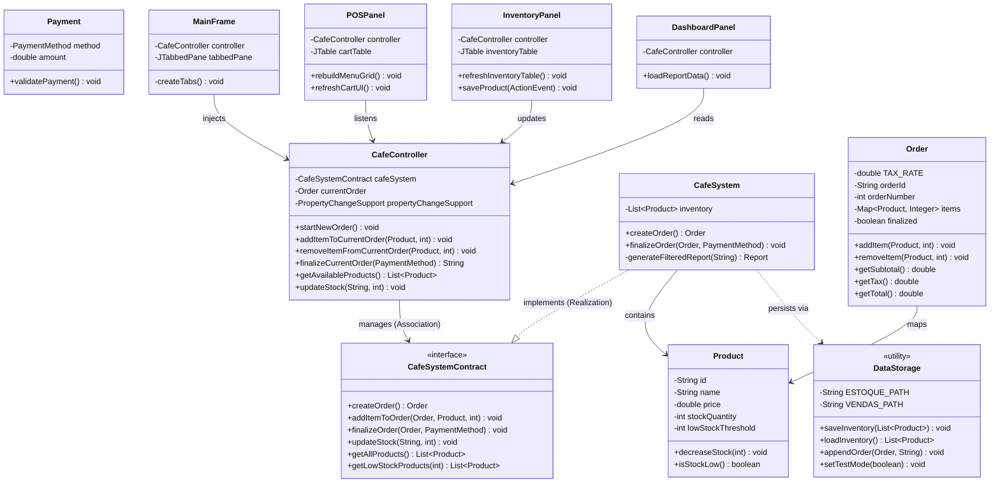

# ☕ Java Café - POS & Inventory System

Project developed for the Object-Oriented Programming course, consisting of a complete Point of Sale (POS) and Inventory Management System with a graphical user interface in Java Swing.

### 👥 Group Identification

* **Davi Azevedo Guedes de Sá** - NUSP 16861585
* **Natanael Costa de Freitas** - NUSP 16894216
* **Pietro Gutiérrez García-Urrutia** - NUSP 17024248

---

## 1. Requirements

The system implements a complete coffee shop management solution for a small café called "Java Café". The core implementations involve a 3-windowed GUI encompassing order processing, inventory management, sales reporting, data persistence, and exception handling systems.

In addition to these base requirements, we implemented custom validations for payment methods (rejecting zero or negative values) and a configurable alert system for real-time low stock monitoring to protect business operations from unexpected stockouts.

## 2. Project Description

The Java Café system was implemented in Java using a modular architecture inspired by the Model-View-Controller (MVC) pattern to ensure low coupling between components:

* **Model:** Contains the core entities and business logic, including classes such as `Product`, `Order`, `Payment`, `Report`, and `CafeSystem`. This layer is responsible for stock control, order processing, and report generation.
* **View:** Consists of Swing components (`MainFrame`, `POSPanel`, `InventoryPanel`, `DashboardPanel`) organized into modular tabs to handle all user interactions.
* **Controller:** The `CafeController` connects the interface to the system logic, processing user actions from the View and updating the Model accordingly.
* **Data Storage:** Handled by the `DataStorage` utility class, which reads and writes data to flat-file CSV files (`estoque.csv` and `vendas.csv`) at startup and after key operations.


### 📂 Directory Structure

The repository is organized following standard Java project conventions, with a clear separation between the MVC layers, automated tests, and runtime data.

```text
Java-Cafe-System/
├── src/
│   ├── main/java/br/usp/icmc/scc0204/javacafe/
│   │   ├── Main.java                 # Application entry point
│   │   ├── model/                    # Entities, exceptions, and business logic (Product, Order)
│   │   ├── view/                     # Swing GUI components (MainFrame, POSPanel, etc.)
│   │   ├── controller/               # MVC Controllers (CafeController)
│   │   └── util/                     # Infrastructure and utilities (DataStorage.java)
│   └── test/java/br/usp/icmc/scc0204/javacafe/
│       └── model/                    # JUnit 5 automated test cases
├── data/                             # Generated at runtime
│   ├── product_images/               # Local image assets for the GUI
│   ├── estoque.csv                   # Inventory flat-file persistence
│   └── vendas.csv                    # Sales records and reports
├── bin/                              # Compiled .class binaries (generated after build)
└── README.md                         # Project documentation
```

## 3. Comments About the Code

The system applies fundamental pillars of Object-Oriented Programming to guarantee maintainability:

* **Polimorfismo:** The graphical interface interacts with the system through the `CafeSystemContract` interface, facilitating dependency injection and testing. Furthermore, we used overriding polymorphism (e.g., `StatusCellRenderer`) to dynamically modify the table cells' background colors based on stock flags.
* **Herança:** Used extensively when extending visual Swing panels (`JPanel`, `JFrame`) and when creating a semantic domain exception architecture (`OutOfStockException`, `EmptyOrderException`, `InvalidPaymentException`) that extends the base `Exception` class.
* **Encapsulamento:** Entities protect their internal state. Product IDs are immutable (`final`), and modifications to the cart (`Order`) occur only via controlled methods (`addItem`/`removeItem`) to ensure exact, tamper-proof financial calculations.

## 4. Test Plan

The quality plan focused on validating critical business rules using automated unit tests. Using the **JUnit 5** library, we developed 20 test cases covering:

1. Adding and removing items with automatic mathematical recalculation of subtotals and 10% service taxes.
2. Domain exception handling for out-of-stock purchases or invalid transaction values.
3. Database isolation via a conditional `testMode` flag inside the data layer, ensuring automated execution sweeps run exclusively on separate temporary files.

## 5. Test Results

The test suite was executed using the JUnit Test Runner. All 20 unit test scenarios were successfully executed (100% pass rate), confirming that the domain exceptions and business logic operate exactly as expected.

*(Due to report page constraints, a condensed log summary is provided below. The fully detailed class execution log is public and can be verified inside the project's repository).*

**Output Log of Technical Execution (JUnit Condensed):**

```text
Test run finished after 152 ms
[         3 containers successful ]
[        20 tests found           ]
[        20 tests successful      ]
[         0 tests failed          ]

BUILD SUCCESSFUL

```

## 6. Build Procedures

Sequential instructions for installing, compiling, and running the system from a clean command-line terminal. **Requires Java JDK 8 or higher.**

**Step 1: Clone the repository and navigate to the project root**

```bash
git clone https://github.com/Natancf/Java-Cafe-System.git
cd Java-Cafe-System

```

**Step 2: Prepare local runtime directories**
Create the necessary folders for storing compiled binaries and local images. The base database files (`.csv`) will be generated automatically on the first execution.

```bash
mkdir -p bin
mkdir -p data/product_images

```

**Step 3: Compile the source code**
Execute the Java compiler pointing to the main initialization class path while referencing the source root:

```bash
javac -d bin -sourcepath src src/main/java/br/usp/icmc/scc0204/javacafe/Main.java

```

**Step 4: Launch the GUI application**

```bash
java -cp bin main.java.br.usp.icmc.scc0204.javacafe.Main

```

## 7. Problems

The main technical bottleneck faced occurred during the integration of JUnit with local flat-file persistence. The `@BeforeEach` methods were executing setups that directly wrote sample products into the actual production CSV files (`data/estoque.csv`), corrupting the initial state of the application.

* **Solution:** We implemented a static method state hook via `DataStorage.setTestMode(boolean)`. Coupled with JUnit's `@BeforeAll` and `@AfterAll` annotations, the test suite now safely intercepts all database operations, despatches them to temporary mock files (`test_estoque.csv`), and deletes them automatically upon tearing down the testing thread.

## 8. Comments

The complete technical documentation for classes, methods, and interface contracts was generated using the **JavaDoc** tool. The interactive HTML site is hosted online via GitHub Pages and can be actively browsed at:

`https://natancf.github.io/Java-Cafe-System/`
